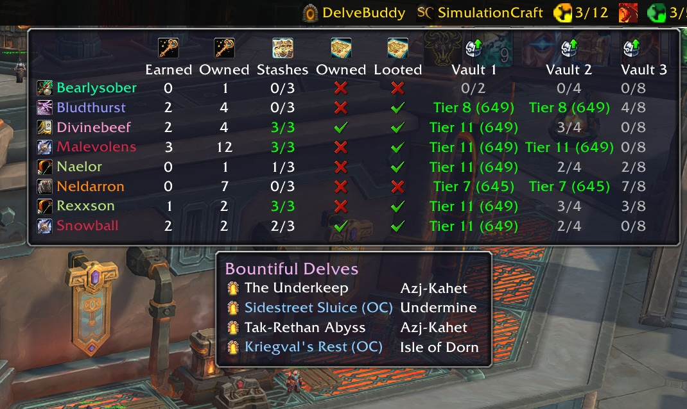
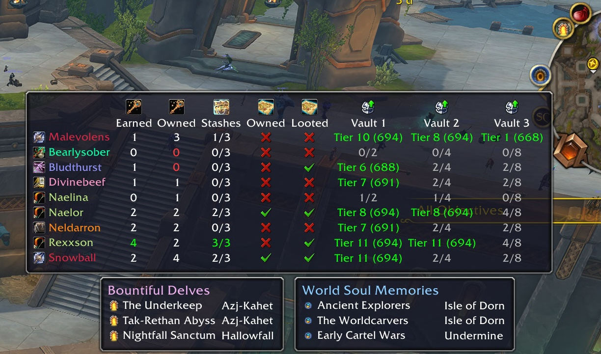

# DelveBuddy

**DelveBuddy** is a World of Warcraft addon for tracking weekly delve activities and rewards on a per-character basis. It's a Data Broker addon, so if you have a data broker display addon (like Titan Panel, ChocolateBar, or Bazooka), you can add it there, and hover over it to see your data in tooltips. There's also a minimap icon to display that info.

## Features

- Tracks weekly delve activities across characters
  - **Restored Coffer Keys**: Tracks weekly earned and total owned keys.
  - **Gilded Stashes**: Tracks weekly Gilded Stash loots.
  - **Delver’s Bounty**: Indicates if you have a bounty item and whether you’ve looted one this week.
  - **Great Vault (World Delves)**: Displays your World activity vault rewards per-tier.
- Displays the currently active Bountiful Delves (and which are overcharged)
 - Click a delve to make a waypoint to it
- Displays a warning you if you enter a Bountiful Delve and do not have a Restored Coffer Key
- Reminds you to use your Delver's Bounty (if you have one) when you're in a Bountiful Delve

## Installation

1. Clone or download this repository into your WoW `Interface/AddOns` folder.
2. Ensure the folder name is `DelveBuddy`.

## Usage

- **Slash Commands:**
  - `/db minimap` — Show/hide the minimap icon.
  - `/db debugLogging 1|0` — Enable/disable debug logs.

- **Data Broker:** Hover over the LibDataBroker icon to see per-character stats, delve lists, and more.
- **Right-click** the broker icon for options (debug logging, minimap icon toggle, remove character).

## Screenshots

## License

See [LICENSE](./LICENSE) for details.

