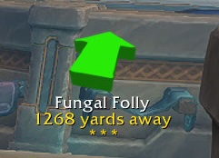
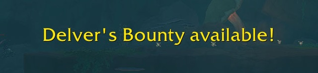
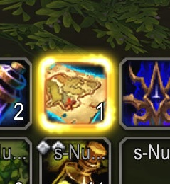

# DelveBuddy

**DelveBuddy** is a World of Warcraft addon that helps you track weekly Delve activities and rewards across all your characters. It integrates with Data Broker displays (e.g., Titan Panel, ChocolateBar, Bazooka) and provides a minimap icon for quick access.

## Features

-	Tracking
    -	**Restored Coffer Keys** (weekly earned and total owned)
    -	**Coffer Key Shards** (weekly earned)
    -	**Gilded Stashes** (weekly loots)
    -	**Delver’s Bounty** (ownership and loot status)
    -	**Great Vault Rewards** (World Delves progress per-tier)
-	UI Enhancements
    - Shows currently active Bountiful Delves
    -	Shows currently active Worldsoul Memories (and Radiant Echoes owned)
    -	Click a Delve or World Soul Memory to create a waypoint
-	Reminders & Warnings
    -	Warns when entering a Bountiful Delve without a Restored Coffer Key
    -	Reminds you to use Delver’s Bounty when inside a Bountiful Delve

## Installation

1. Clone or download this repository into your WoW `Interface/AddOns` folder.
2. Ensure the folder name is `DelveBuddy`.

## Usage

- **Slash Commands:**
  - `/db minimap` — Show/hide the minimap icon.
  - `/db debugLogging 1|0` — Enable/disable debug logs.

- **Data Broker:** Hover over the LibDataBroker icon or minimap icon to see DelveBuddy's tooltip UI
- **Right-click** the broker icon for options (debug logging, minimap icon toggle, remove character).

## Screenshots

## License

See [LICENSE](./LICENSE) for details.

